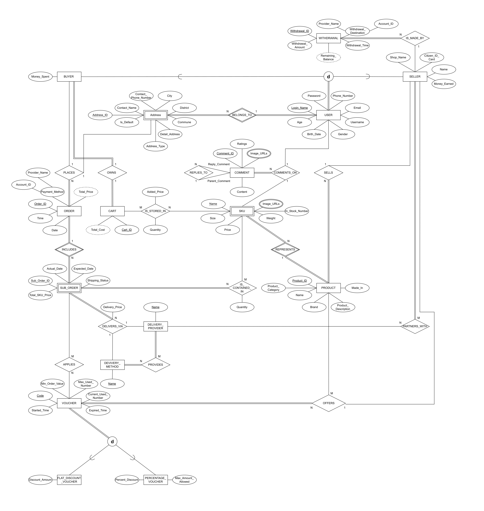
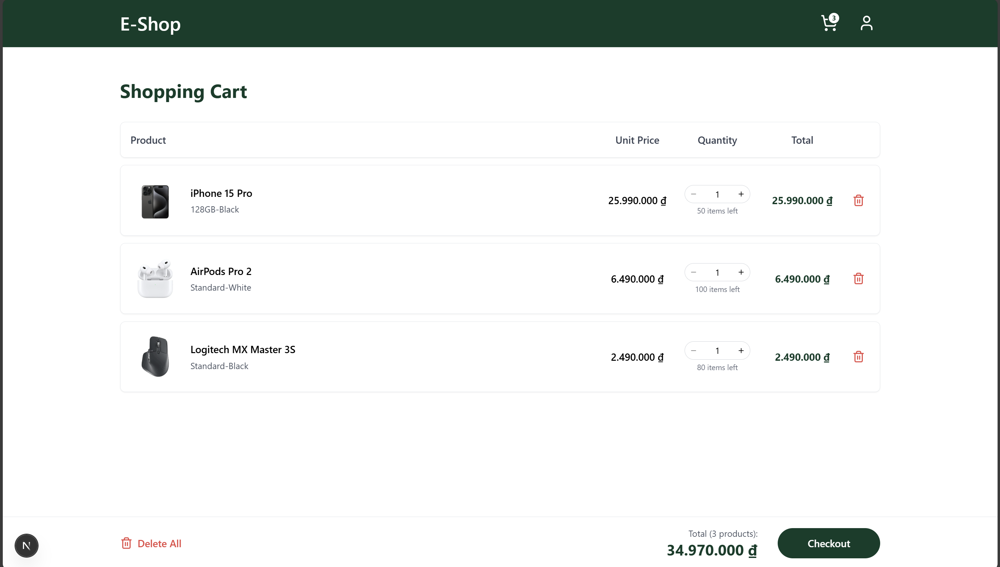
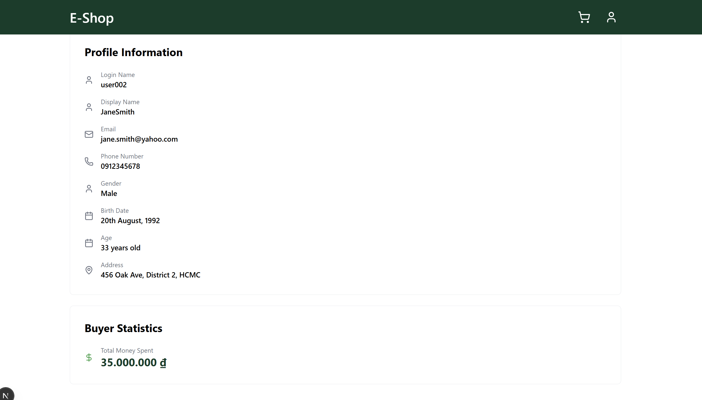

# E-commerce Website Project

This project contains a Next.js frontend and an Express.js backend for an e-commerce website. The backend models are based on the provided SQL schema.

## Structure
- `frontend/`: Next.js app
- `backend/`: Express.js API
- `shared/`: Shared types/models
- `backend/`: DDL, DCL and DML

## Setup
See individual README files in `frontend/` and `backend/` for instructions.

## EER Diagram

  

## Relational Schema

  

## Function, Procedure and Trigger

### Function
- `func_CalculateCartTotal`: Calculate TotalCost of Cart based on Quantity of StoredSKU and Price in SKU
- `func_CalculateSubOrderCost`: Calculate TotalCost in SubOrder based on Total_SKU_Price + Delivery Price + Applied Voucher discount

### Procedure
- `prc_UpdateQuantityStoredSKU`: Update quantity of SKUs stored in buyer’s cart.
- `prc_CreateOrderFromStoredSKU`: Insert values into Order, SubOrder and SubOrderDetail tables based on table StoredSKU
- `prc_UpdateMoney`: Update MoneySpent if a user is a buyer or MoneyEarned if a user is a seller
- `prc_UpdateInStockNumber`: Update number of SKUs after a buyer placed order to buy them
- `prc_DeleteStoredSKU`: Delete all the SKUs stored in Cart after being bought by a buyer.

### Trigger
- `trg_UpdateCartTotal`: Recalculate the total cost of SKUs stored in Buyer’s cart after they modify (insert, delete or update quantity) any SKUs in their own cart.
- `trg_AfterInsertSubOrderDetails`: After inserting data into SubOrderDetail table, update InStockNumber, MoneySpent of the buyer, MoneyEarned of the seller, Delete all SKUs stored in buyer’s cart and Set the total cost of their cart into 0.
- `trg_ValidVoucherDates`: Constraint that Voucher StartedTime must be earlier than ExpiredTime

## Application UI Demonstration

### Shopping Cart Interaction
Demonstrates `trg_UpdateCartTotal`: Automatic recalculation of cart totals when items are modified.

  

### Buyer Statistics & Order Processing
Demonstrates `trg_AfterInsertSubOrderDetails`: Automated updates to inventory, buyer spending stats, and seller earnings upon order completion.

  

